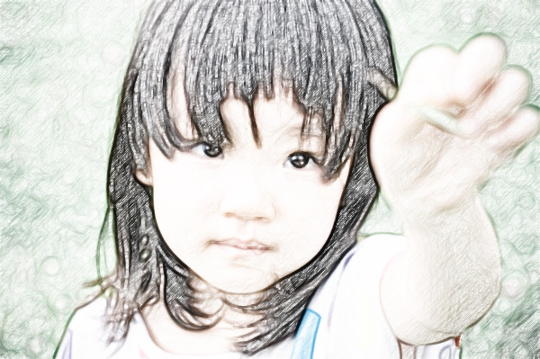
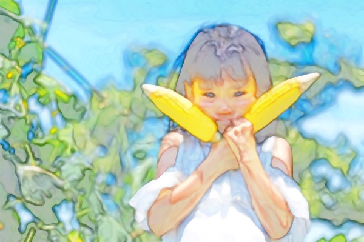
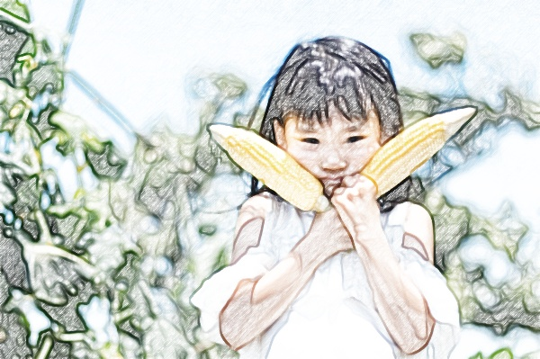
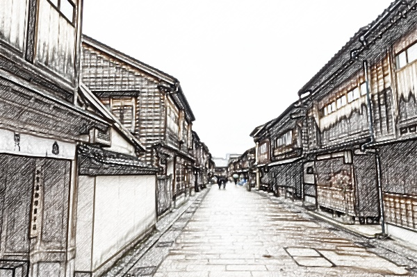
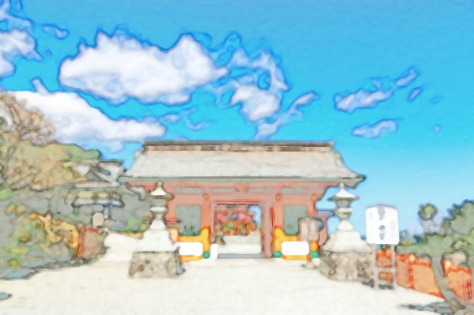
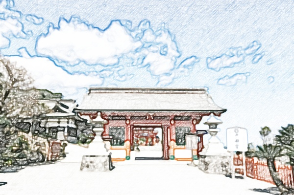
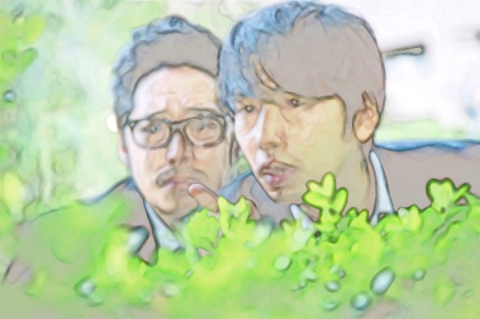
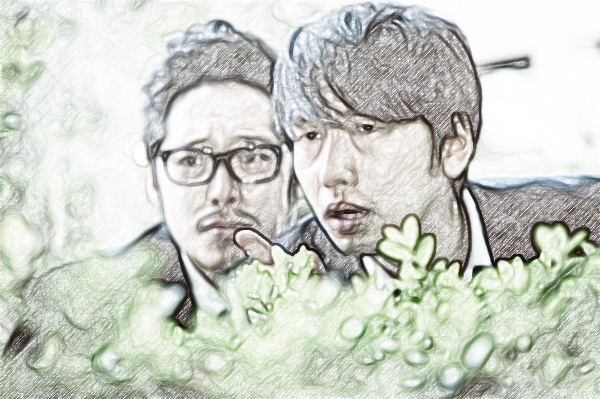
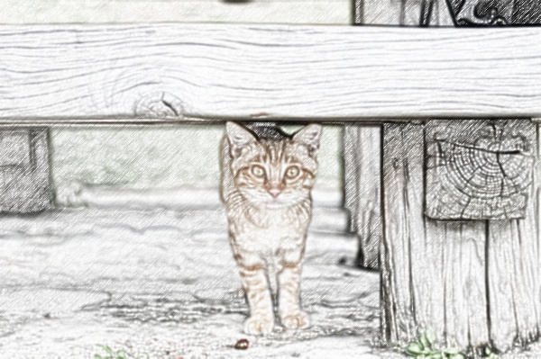

# Yz-VideoEffect
## はじめに
Yz-Filerの画像効果を動画に対して行うツールです。  
速度改善のために、OpenCVに変更してるので、処理結果が変わってると思います。

## インストール・設定
- 動作環境は、Windows10 64bit .NET Framework 4.6.1以上となります。
- レジストリは使用してません。
- 任意のディレクトリに、「Yz-VideoEffect_1.0.zip」を解凍してください。
- 解凍時に作成されたディレクトリに、「OpenCvSharpExtern.zip」を解凍して下さい
- ウィルスチェックは実施済みです
- アンインストールはディレクトリごと削除して下さい。
- 保存にはffmpegが必要となります

## 画像効果
 | 0:Edge<br>　　　　　　(エッジ)　　　　　　| 1:binarization<br>(2値化) | 2:Ternarization<br>(3値化/漫画風) |
:----: | :----: | :----: 
 |  |  

| 3:Watercolor<br>(水彩画風) | 4:Blackboard<br>(黒板アート風) | 5:Sketch<br>　　　　(スケッチ風)　　　　|
 :----: | :----: | :----: 
 |  |  

## オプション
| ショート形式<br>(short) | ロング形式<br>(long) | 必須<br>(Required) | モード<br>(effect mode) | 説明<br>(description) |
:--- | :--- | :---: | :---: | :--- 
-m | --effect_mode | true | all | 画像効果の種類を数字で指定<br>Effect mode<br> 0 : Edge<br> 1 : binarization<br> 2 : Ternarization<br> 3 : Watercolor<br> 4 : Blackboard<br> 5 : Sketch
-i | --input | true | all | 動画のフルパス<br>Full path of video file
-s | --maxsize | - | all | 出力動画の最大サイズ<br>Maximum size<br> 0 : SD (720x480)(Default)<br> 1 : HD (1280x720)<br> 2 : FHD (1920x1080)
-b | --background | - | all | 背景画像のフルパス<br>Full path of background image file
-w | --video_width | - | all | ビデオの最大幅(縮小用)<br>Video width
-h | --video_height | - | all | ビデオの最大高(縮小用)<br>Video height
-x | --left | - | all | 背景画像上のビデオ左端<br>(はみだせない)<br>Left
-y | --top | - | all | 背景画像上のビデオ上端<br>(はみだせない)<br>Top
-t | --threshold | - | Binarization | 2値化の閾値<br>threshold(0-255) (Default:128)
 |  |  |  | Watercolor | 水彩画風の適用度(%)<br>strength(0-100) (Default:70%)
 |  |  |  | Blackboard | 黒板アート風のノイズの閾値<br>noise threshold(0-255) (Default:8)
-u | --edge_th1 | - | Edge<br>binarization | エッジをつなげる設定値<br>(小さい程繋がる)<br>Edge threshold1 (Default:300)
-v | --edge_th2 | - | Edge<br>binarization | エッジ検出の設定値<br>(小さい程検出する)<br>Edge threshold2 (Default:1000)
-o | --ternarization_th1 | - | Ternarization | 3値化の下限閾値(黒くなる範囲)<br>threshold1(0-255) (Default:85)
-p | --ternarization_th2 | - | Ternarization | 3値化の上限閾値(白くなる範囲)<br>下限との間がグレー<br>threshold2(0-255) (Default:170)
-l | --luminance_mode | - | all | 輝度のアルゴリズム<br>0 : 最小/最大を0/255にし、平坦化<br>1 : 上下2%をカットし上と同じ<br>2 : OpenCVのEqualizeHist<br>Luminance mode (0-2)
-g | --sketch_gamma | - | Sketch | スケッチ風のガンマ値<br>(小さい程濃くなる)<br>gamma value (Default:0.3)
-n | --sketch_noise | - | Sketch | スケッチ風の時ノイズを更新するか<br>Updates the noise image<br> frame by frame (Default:false)
-z | --stdout | - | all | 標準出力に出力するか<br>Output to standard output<br>(Default:false)

## 実行方法
オプションを複数指定する場合は、以下のような内容のbatファイルを作成した方が便利だと思います。  
(batは「^」により、コマンドの途中で改行可能です)  
(必須項目以外は指定しなくてもデフォルト設定で動作します)
```
Yz-VideoEffect.exe ^
--effect_mode 1 ^
--input "hoge.mp4" ^
--maxsize 0 ^
--threshold 128 ^
--edge_th1 300 ^
--edge_th2 1000 ^
--luminance_mode 1 ^
--stdout false
```
上記で作成したbatをDOS窓で実行すると、Windowが起動され動画が表示されます。  
このモード(--stdout false)では、動画を処理する都度、更新されるため再生速度は維持されません。  
実行後、DOS窓に以下のような内容が表示されます。
```
--------------------
[Input video]
fps:29.97
FrameWidth:960
FrameHeight:540

[Output video]
fps:29.97
FrameWidth:720
FrameHeight:405

[Back image]
Width:720
Height:405
--------------------
```
「fps」と、「Back image」の「Width」「Height」が保存時に必要となります。  
（実行を中断したい場合は、DOS窓をクリックしてCtr+Cキーを押して中断して下さい）

## 保存方法
「実行方法」で作成したbatを以下のように変更します
```
Yz-VideoEffect.exe ^
--effect_mode 1 ^
--input "hoge.mp4" ^
--maxsize 0 ^
--threshold 128 ^
--edge_th1 300 ^
--edge_th2 1000 ^
--luminance_mode 1 ^
--stdout true ^
 | ffmpeg -y -f rawvideo -pixel_format bgr24 -video_size 720x405 -framerate 29.97 -i - -an -vcodec libx264 -pix_fmt yuv420p "out.mp4"
```
最後の2行を変更してます。「--stdout」を「true」に変更し、ffmpegにデータを渡します。  
「video_size」と「framerate」に「実行方法」で確認した「Width」「Height」と「fps」を指定して下さい。  
尚、ffmpegの保存用オプションは、ffmpegの解説HPなどを参照してください。  

## 制限など
- 音声は出力されません。
- やっつけツールですんで、エラーハンドリングはやってません。

## ライブラリ類およびライセンス
- 本ソフトウェア（Yz-VideoEffect）  
  Copyright (c) 2021 Yz  
  Released under the MIT license  
  https://opensource.org/licenses/mit-license.php  
  作者または著作権者は、本ソフトウェアに起因して被った直接的または間接的損害については一切責任を負わず、また保証/補償も出来ません  
  以下のライブラリ類については、それぞれのライセンスに従ってください  
  Please accept the license agreement for each library
  
- OpenCVSharp  
  Apacheライセンス バージョン2.0  
  https://github.com/shimat/opencvsharp/blob/master/LICENSE

- OpenCV  
  Apacheライセンス バージョン2.0  
  https://github.com/opencv/opencv/blob/master/LICENSE

- Fred's ImageMagick Scripts  
  画像効果のアルゴリズムを参考にさせて貰ってます。  
  非商用目的のみ無料で利用可  
  ```
  My scripts are available free of charge for non-commercial (non-profit) use, ONLY.
  ```
  http://www.fmwconcepts.com/imagemagick/index.php

## 処理結果イメージ
「ぱくたそ（www.pakutaso.com）
」さんが加工・公開OKだということなので使わせてもらいました。  
（下記画像の取り扱いについては、ばくたそさんの規約を守ってください）  
以下のコマンドで、静止画から動画へ変換した後、処理してます。
```
ffmpeg -loop 1 -i "hoge.jpg" -vcodec libx264 -pix_fmt yuv420p -t 1 -r 30 "out.mp4"
```  
上記コマンドは、画像のサイズが縦・横ともに偶数じゃないとエラーになりますので気を付けてください。  
| Watercolor (水彩画風) | Sketch (スケッチ風) |
:----: | :----: 
 |  
 |  
 |  
 |  
 |  
 |  
 |  
 |  
 |  
 |  
