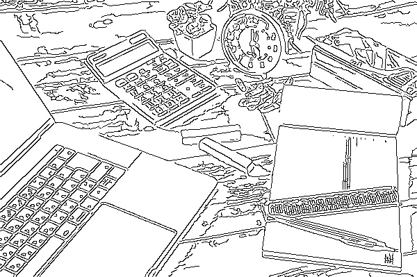

# Yz-VideoEffect / Yz-ImageEffect
## はじめに
Yz-Filerの画像効果をパラメータを指定して写真 / 動画に対してより高速に行うために作成しました。  
(速度改善のためにOpenCVに変更してるので、Yz-Filerとは処理結果が変わっています)  
対応している画像効果は、エッジ、2値化、3値化、水彩画風、黒板アート風、スケッチ風、アニメ風の7つです。  
高価なソフトウェアを使わずに手軽に画像効果をつけることができます。  
※Ver1.1から、写真をアニメ風に変換するモード(effect_mode:6)を追加しました。  
※Ver1.2から、以下の変更を行いました。  
　・アニメ風変換時の色破綻を軽減するモード(effect_mode:7, 8)を追加しました。  
　・3値化で輪郭線を描くように変更しました。  
　・ぼかしとシャープフィルタを変更＆追加しました。  
※Ver1.3から、アニメ風の簡易モード（ほぼ減色＆ぼかしだけのモード。effect_mode:9)を追加しました。  
　また、アニメ風モード時にガンマ補正が出来るように修正しました。  

-	Yz-VideoEffectは動画用でコマンドラインツールとなります。  
  （背景画像を指定して合成することができます）  
  「絵から実写に変化した」「止まっていた黒板の絵が動き出した」「Tシャツのカエルが跳ねた」  
  など、工夫次第で一発受けくらい狙えるかもしれません。  
-	Yz-ImageEffectは静止画用でGUIツールとなります。  
  （コマンドライン引数として静止画のフルパスを渡すことができます）  
  写真を変換して、HPやプレゼンなどの素材に。また、アニメ風に変換した顔に、画像編集ソフトを  
  使ってアニメ風の目などを貼り付けると、より面白い画像になります。

## 画像効果
 | 0:Edge<br>　　　　　　(エッジ)　　　　　　| 1:binarization<br>(2値化) | 2:Ternarization<br>(3値化/漫画風) |  
| :----: | :----: | :----: |  
|  |  |  |  

| 3:Watercolor<br>(水彩画風) | 4:Blackboard<br>(黒板アート風) | 5:Sketch<br>　　　　(スケッチ風)　　　　|
 :----: | :----: | :----: 
||

| 6:Anime<br>(アニメ風) |
 :----: 
||

## インストール・設定
- 動作環境は、Windows10 64bit .NET Framework 4.6.1以上となります。
- レジストリは使用してません。
- 任意のディレクトリに、「Yz-VideoEffect_1.3.zip」を解凍してください。
- 解凍時に作成されたディレクトリに、「OpenCvSharpExtern.zip」を解凍して下さい。
- ウィルスチェックは実施済みです。
- アンインストールはディレクトリごと削除して下さい。
- 動画の保存にはffmpegが必要となります。

## 向いてる素材 / 向いてない素材
- 向いてると思う素材
  - 人や動物、風景など
  - 直線が多い素材
    - ビル、街並み、店の外観、古都など
    - 雑然としたオフィス、家具の多い部屋など
    - 乗り物、ロボットなど機械的な物
    - 文房具や工具など
  - 2次元素材  
    絵やイラスト、アニメ、ゲームなど2次元素材も向いてる場合があります。

- 向いてないと思う素材  
  事前に加工することで問題がなくなる場合もあります。  
  - 明るすぎる物や全体的に白っぽい素材
  - 暗すぎる物や全体的に黒っぽい素材
  - 写ってる物が少なく、背景が単色の素材
  - ノイズが多い素材（暗い素材は目立たないけどノイズが多い場合があります）
  - コントラストが高すぎるまたは低すぎる素材

## 動画用オプション（静止画の同様オプションは同義）
| ショート形式<br>(short) | ロング形式<br>(long) | 必須<br>(Required) | モード<br>(effect mode) | 説明<br>(description) |
:--- | :--- | :---: | :---: | :--- 
-m | --effect_mode | true | all | 画像効果の種類を数字で指定<br>Effect mode (0-9)<br> 0 : Edge<br> 1 : binarization<br> 2 : Ternarization<br> 3 : Watercolor<br> 4 : Blackboard<br> 5 : Sketch<br>6,7,8,9 : Anime
-i | --input | true | all | 動画のフルパス<br>標準入力から取得する場合は、<br>「PIPE:WxH,FPS」を指定<br>Full path of video file
-s | --maxsize | - | all | 出力動画の最大サイズ<br>Maximum size (0-2)<br> 0 : SD (720x480)(Default)<br> 1 : HD (1280x720)<br> 2 : FHD (1920x1080)
-b | --background | - | all | 背景画像のフルパス<br>Full path of background image file
-w | --video_width | - | all | ビデオの最大幅(縮小用)<br>Video width
-h | --video_height | - | all | ビデオの最大高(縮小用)<br>Video height
-x | --left | - | all | 背景画像上のビデオ左端<br>(はみだせない)<br>Left
-y | --top | - | all | 背景画像上のビデオ上端<br>(はみだせない)<br>Top
-t | --threshold | - | Binarization | 2値化の閾値<br>threshold(0-255) (Default:128)
 |  |  |  | Watercolor | 水彩画風の適用度(%)<br>strength(0-100) (Default:70%)
 |  |  |  | Blackboard | 黒板アート風のノイズの閾値<br>noise threshold(0-255) (Default:8)
 |  |  |  | Anime | アニメ風の減色設定値<br>color reduction parameter(0-255)<br> (Default:64)
-u | --edge_th1 | - | Edge<br>binarization<br>Ternarization<br>Anime | エッジをつなげる設定値<br>(小さい程繋がる)<br>Edge threshold1 (Default:300)
-v | --edge_th2 | - | Edge<br>binarization<br>Ternarization<br>Anime | エッジ検出の設定値<br>(小さい程検出する)<br>Edge threshold2 (Default:1000)
-o | --ternarization_th1 | - | Ternarization | 3値化の下限閾値(黒くなる範囲)<br>threshold1(0-255) (Default:85)
-p | --ternarization_th2 | - | Ternarization | 3値化の上限閾値(白くなる範囲)<br>下限との間がグレー<br>threshold2(0-255) (Default:170)
-l | --luminance_mode | - | all | 輝度のアルゴリズム<br>Luminance mode (0-3)<br>0 : 最小/最大を0/255にし平坦化<br>1 : 上下2%をカットし上と同じ<br>2 : OpenCVのEqualizeHist<br>3 : OpenCVのClahe
-f | --blur | - | all | ぼかしフィルタ<br>Blur mode (0-9)<br>0 : Median Blur (ksize=3)<br>1 : Median Blur (ksize=5)<br>2 : Gaussian Blur (σ=1.0)<br>3 : Gaussian Blur (σ=2.0)<br>4 : Gaussian Blur (σ=3.0)<br>5 : Gaussian Blur (σ=4.0)<br>6 : FastGlobal SF (λ=4)<br>7 : FastGlobal SF (λ=10)<br>8 : FastGlobal SF (λ=16)<br>9 : FastGlobal SF (λ=22)
-j | --sharpen | - | all | シャープ化フィルタ<br>Sharpen mode (0-8)<br>0 : Sharpen (0.5)<br>1 : Sharpen (1.0)<br>2 : Sharpen (1.5)<br>3 : UnsharpMask (1.0)<br>4 : UnsharpMask (4.0)<br>5 : UnsharpMask (7.0)<br>6 : DetailEnhance (6.0)<br>7 : DetailEnhance (12.0)<br>8 : DetailEnhance (18.0)
-g | --sketch_gamma | - | Sketch | スケッチ風のガンマ値<br>(小さい程濃くなる)<br>gamma value (Default:0.3)
 |  |  |  | Anime | アニメ風のガンマ値<br>(1より大きいと色が薄くなる)<br>gamma value (Default:1.0)
-n | --sketch_noise | - | Sketch | スケッチ風の時ノイズを更新するか<br>Updates the noise image<br> frame by frame (Default:false)
-c | --fade_in | - | all | ソース画像から徐々にエフェクト<br>画像に変更（フレーム番号）<br>effect fade in (1-last frame)<br>(source -> effect)
-d | --fade_out | - | all | エフェクト画像から徐々にソース<br>画像に変更（フレーム番号）<br>effect fade out (1-last frame)<br>(effect -> source)
-e | --fade_rate | - | all | fade in / fade out のフレーム毎の<br>変化率(%)<br>fade change rate per frame (1-100)<br>(Default:2%)
-z | --stdout | - | all | 標準出力に出力するか<br>Output to standard output<br>(Default:false)

## 実行方法（動画）
このモード(--stdout false)では、動画を処理する都度、更新されるため再生速度は維持されません。  
（実行を中断したい場合は、DOS窓をクリックしてCtr+Cキーを押して中断して下さい）
- 動画をファイルから取得する場合  
  オプションを複数指定する場合は、以下のような内容のbatファイルを作成した方が便利だと思います。  
  (batは「^」により、コマンドの途中で改行可能です)  
  (必須項目以外は指定しなくてもデフォルト設定で動作します)
  ```
  Yz-VideoEffect.exe ^
  --effect_mode 1 ^
  --input "hoge.mp4" ^
  --maxsize 0 ^
  --threshold 128 ^
  --edge_th1 300 ^
  --edge_th2 1000 ^
  --luminance_mode 1 ^
  --stdout false
  ```
  上記で作成したbatをDOS窓で実行すると、Windowが起動され動画が表示されます。  

- 動画を標準入力から取得する場合  
  入力ファイル名に「PIPE:WxH,FPS」(W, H, FPSは数値)を指定した場合、標準入力から動画を取得します。  
  以下は、事前にインターレース解除をffmpegで実施する例となります。
  ```
  ffmpeg -i "hoge.mp4" -an ^
  -vf yadif=0:-1:1 ^
  -vcodec rawvideo -f image2pipe -pix_fmt bgr24 - ^
   | Yz-VideoEffect.exe ^
  --effect_mode 5 ^
  --input "PIPE:960x540,29.97" ^
  --stdout false
  ```
  こちらも同じくDOS窓で実行して下さい。  
  参考までに、ffmpegを使って事前に減色（例では32色にしてます）する場合は、以下のフィルタで出来るようです。  
  上記の「-vf」の行と入れ替えると動作します。
  （ffmpegについては解説HPなどを参照して下さい）
  ```
  -filter_complex "split[a][b];[a]palettegen=max_colors=32:stats_mode=2[pal];[b][pal]paletteuse=dither=none:new=1" ^
  ```

- 画像効果の効きが悪い時  
・事前にインターレース解除をして下さい。  
・解像度が高いと写真っぽく見えやすいので、「--maxsize」を0にしてみて下さい。  
・ぼかしフィルタを強めにしてみて下さい。  
・事前に、コントラスト・輝度・彩度の調整やノイズ除去を実施してみて下さい。  
・アニメ風にする場合  
　-> effect_modeを7～9にすると、我慢すれば視聴できるかもしれません。  
　-> 色を薄く（sketch_gammaを1より大きく）するとイラストっぽく見えるかもしれません。  
　-> ffmpegで彩度を上げたり、青みがかるように調整してみて下さい。  
　-> blurにFastGlobal SFを指定すると境界が滑らかになるかもしれません。  

- 保存のためのパラメータ確認  
実行すると、DOS窓に以下のような内容が表示されます。
  ```
  --------------------
  [Input video]
  fps:29.97
  FrameWidth:960
  FrameHeight:540
  
  [Output video]
  fps:29.97
  FrameWidth:720
  FrameHeight:405
  
  [Back image]
  Width:720
  Height:405
  --------------------
  ```
  「fps」と、「Back image」の「Width」「Height」が保存時に必要となります。  

## 保存方法（動画）
「実行方法」で作成したbatを以下のように変更します
```
Yz-VideoEffect.exe ^
--effect_mode 1 ^
--input "hoge.mp4" ^
--maxsize 0 ^
--threshold 128 ^
--edge_th1 300 ^
--edge_th2 1000 ^
--luminance_mode 1 ^
--stdout true ^
 | ffmpeg -y -f rawvideo -pixel_format bgr24 -video_size 720x405 -framerate 29.97 -i - -an -vcodec libx264 -pix_fmt yuv420p "out.mp4"
```
最後の2行を変更してます。「--stdout」を「true」に変更し、ffmpegにデータを渡します。  
「video_size」と「framerate」に「実行方法」で確認した「Width」「Height」と「fps」を指定して下さい。  
尚、ffmpegの保存用オプションは、ffmpegの解説HPなどを参照してください。  

## 実行方法（静止画）
GUIツールなので、Yz-ImageEffect.exeをそのまま起動するか、コマンドライン引数として静止画のフルパスを指定して下さい。  
オプションの意味は動画と同じなので、動画のオプション説明を参照してください。  
ただし、背景画像の指定はできません。  
保存形式は、OpenCVが対応している形式(jpg, png, bmpなど)であれば拡張子で自動判定されると思います。  
※解像度が高いと挙動が遅くなります。初めに幅を1000くらいまで下げてパラメータ調整した後、出力解像度に戻して微調整して下さい。

画像効果の効きが悪い時は、以下を試してみて下さい  
・解像度が高いと写真っぽく見えやすいので、画像の幅を500～800くらいに落としてみて下さい。  
・ぼかしフィルタを強めにしてみて下さい。  
・事前に、コントラスト・輝度・彩度の調整やノイズ除去を実施してみて下さい。  
・アニメ風の場合、画像編集ソフトで事前に編集するとそれっぽくなる場合があります。  
　-> 彩度を上げたり、青みがかるように色を調整する  
　-> 空を見栄えの良い空に差し替える  
　-> 小物を貼り付けたり、目にアニメ目を貼り付け、アニメ化時に縮小する  
・アニメ風にする場合  
　-> 色を薄く（sketch_gammaを1より大きく）するとイラストっぽく見えるかもしれません。  
　-> blurにFastGlobal SFを指定すると境界が滑らかになるかもしれません。  

幅や高さを変更した時、  
・縦横比を維持するので幅か高さを変更すれば、もう一方は自動的に計算されます。  
　(縮小率が高い方優先)  
・ 画面に表示されてる画像は拡大/縮小されませんが解像度が変化しており、保存時には  
　指定したサイズで保存されます。  
 
 
尚、静止画で背景画像を指定したい場合、Yz-VideoEffectを使うことが出来ます。  
```
ffmpeg -i "hoge.jpg" -an -vcodec rawvideo -f image2pipe -pix_fmt bgr24 - ^
 | Yz-VideoEffect.exe ^
--effect_mode 5 ^
--input "PIPE:960x540,1" ^
--background "background.jpg" ^
--maxsize 1 ^
--video_width 1000 ^
--stdout true ^
 | ffmpeg -y -f rawvideo -pixel_format bgr24 -video_size 1280x720 -i - -an -vframes 1 -f image2 "out.jpg"
```

## 制限など
- 動画出力には音声は含まれません。
- 標準入力から渡す場合は、音声を除外して下さい。
- 入力ファイルは、事前にインターレース解除をしておいてください。
- 自分で撮影した素材の場合、事前にノイズ除去や輝度・彩度などの補正もやっておいたほうが良いかもしれません。
- 縦横比は維持しますが、アスペクト比（4：3や16：9など）は見てません。  
  ffmpegを活用してアスペクト比を維持するよう調整して下さい。  
- アニメ風は、動画では色がコロコロ変わるのであまりお勧めできません。  
  （effect_mode 9は、単純な減色＆ぼかし処理のため、色がコロコロ変わらないと思います）  
- アニメ風のeffect_mode 7,8は、処理が重たくノッペリ感は減りますが、色破綻が軽減されます。  
  ・まだ色がコロコロ変わりますが、我慢すれば動画視聴できるかもしれません。  
  ・色破綻軽減処理の影響でアニメというよりイラスト？絵画？っぽくなりました。  
  ・明るさの変動で色が破綻する場合、luminance_modeを3にしてみて下さい。  
- 処理速度はeffect_mode 7,8とDetailEnhanceを除き、SD画質が処理できるレベルを想定しています。高解像度にすると処理速度は遅くなります。
- やっつけツールですんで、エラーハンドリングはやってません。

## ライブラリ類およびライセンス
- 本ソフトウェア（Yz-VideoEffect）  
  Copyright (c) 2021 Yz  
  Released under the MIT license  
  https://opensource.org/licenses/mit-license.php  
  作者または著作権者は、本ソフトウェアに起因して被った直接的または間接的損害については一切責任を負わず、また保証/補償も出来ません  


  以下のライブラリ類については、それぞれのライセンスに従ってください  
  Please accept the license agreement for each library  
  非商用目的であれば問題なさそうですが、作者は各ライブラリのライセンスについて、法的に判断する知識を有してませんので、利用者責任でお願いします。
  
- OpenCVSharp  
  Apacheライセンス バージョン2.0  
  https://github.com/shimat/opencvsharp/blob/master/LICENSE

- OpenCV  
  Apacheライセンス バージョン2.0  
  https://github.com/opencv/opencv/blob/master/LICENSE

- Fred's ImageMagick Scripts  
  画像効果のアルゴリズムを参考にさせて貰ってます。  
  非商用目的のみ無料で利用可  
  ```
  My scripts are available free of charge for non-commercial (non-profit) use, ONLY.
  ```
  http://www.fmwconcepts.com/imagemagick/index.php

## 処理結果イメージ
「ぱくたそ（www.pakutaso.com）
」さんが加工・公開OKだということなので使わせてもらいました。  
（掲載画像の取り扱いについては、ばくたそさんの規約を守ってください）  
| Watercolor<br>(水彩画風) | Sketch<br>(スケッチ風) | Anime<br>(アニメ風)
:----: | :----: | :----: 
||
||
||
||
||
||
||
||
||
||
